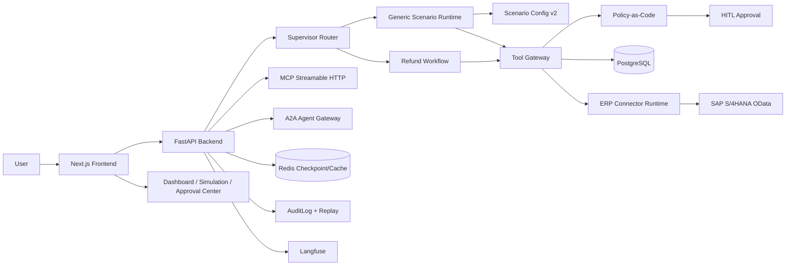

# Enterprise Ticket Agent

一个面向企业业务流程的 **Configurable Supervisor-based Multi-scenario Agent Platform**。项目从单一“自动化退款 Agent”升级为可配置的多场景企业 Agent 平台，支持场景路由、配置化运行时、Tool Gateway、Policy-as-Code、多级 HITL 审批、RAG 政策问答、Simulation Lab、Eval 与链路观测。


## Online Demo

- Frontend: [https://enterprise-ticket-agent.vercel.app](https://enterprise-ticket-agent.vercel.app)
- Backend health: [https://enterprise-ticket-agent-backend.onrender.com/health](https://enterprise-ticket-agent-backend.onrender.com/health)

Admin pages:

- Scenario Studio: `/admin/scenarios`
- Simulation Lab: `/admin/simulation`
- Approval Center: `/admin/approvals`
- Platform Capability Console: `/admin/platform`
- ERP Connector Control Plane: `/admin/connectors`
- Mini ERP Business Data: `/admin/business-data`
- Master Data Governance: `/admin/master-data`
- Observability Dashboard: `/dashboard`

## What This Project Shows

这个项目重点展示的不是“调一个 LLM API”，而是企业 Agent 落地时更关键的工程能力：

- **Supervisor 场景路由**：先由 supervisor 判断业务场景，再进入退款、权限申请、报销等不同 workflow。
- **Configurable Runtime**：权限申请、报销场景通过 JSON 配置驱动 slot extraction、tool mapping、policy binding、UI template。
- **Tool Gateway**：所有有副作用的工具调用统一经过权限、风险、幂等、审计边界。
- **Policy-as-Code**：审批规则从代码逻辑中抽离，支持确定性治理和安全测试。
- **Human-in-the-loop**：高风险动作进入人工审批，支持多级审批链和 `stageId`。
- **Permission-aware RAG**：退款政策问答返回引用来源和政策条款 ID，降低幻觉。
- **Replay / Observability**：每个节点写入 AuditLog，Dashboard 可查看 trace replay、节点耗时、失败率。
- **Eval / Simulation Lab**：支持 golden cases、场景级 eval、配置 dry-run，降低发布风险。
- **SAP OData Connector Runtime**：支持 Mock/Live、API Key/OAuth/Principal Propagation、CSRF、ETag、分页、超时重试、熔断和只读/Shadow 保护。
- **财务 Saga**：退款执行覆盖贷项凭证、客户未清项清账，以及清账失败后的自动冲销补偿。
- **MCP + A2A**：提供 MCP Streamable HTTP 工具调用端点和 A2A Agent Card/任务生命周期，外部 Agent 无法绕过 Tool Gateway 与 HITL。
- **持续发布门禁**：自动检查 Policy fail-closed、工具策略覆盖、ERP 写操作审批/幂等、场景 Eval 与 SAP 连接状态。
- **Model Gateway 与成本治理**：节点级 Gemini/OpenAI/Anthropic 路由、provider failover、统一结构化输出与会话/每日成本账本。
- **Durable Approval Inbox**：待办队列、SLA 倒计时/超时升级、批量审批、审批意见和申请人/审批人双视图。

## Supported Scenarios

| Scenario | Description | Runtime Style |
| --- | --- | --- |
| Refund | 订单退款、风控、自动退款或人工审批 | LangGraph workflow |
| Permission Request | 企业系统/RBAC 权限申请 | Config-driven generic runtime |
| Reimbursement | 报销申请、金额识别、财务审批 | Config-driven generic runtime |
| Policy QA | 退款政策问答，返回 citations | RAG workflow |

## Architecture



## Core Workflow

1. 前端通过 SSE 调用 `/api/chat`。
2. 后端 LangGraph 进入 `supervisor_router`。
3. Supervisor 根据场景配置和 fallback router 选择 workflow。
4. Runtime 执行 slot extraction、Tool Gateway、Policy-as-Code。
5. 低风险动作自动处理，高风险动作进入 HITL 审批。
6. 所有节点输出 UI event、AuditLog、trace metadata。
7. Dashboard 可以按 `thread_id` 回放完整执行链路。

## Tech Stack

| Layer | Stack |
| --- | --- |
| Agent Orchestration | LangGraph, LangChain |
| Backend | FastAPI, Pydantic v2, SQLAlchemy async, Alembic |
| Frontend | Next.js 15, React 19, Vercel AI SDK, Tailwind, shadcn/ui |
| Data | PostgreSQL, Redis |
| LLM / RAG | Provider-neutral Gateway (Gemini/OpenAI/Anthropic), pgvector, TF-IDF fallback, citations |
| Observability | AuditLog, Dashboard replay, Langfuse |
| Deployment | Docker Compose, Render, Vercel |

## Quick Start

### Docker Compose

```bash
git clone https://github.com/Milozzz/enterprise-ticket-agent.git
cd enterprise-ticket-agent

cp .env.example .env
# Optional: fill GOOGLE_API_KEY / LANGFUSE keys / Gmail config

docker compose up --build
```

Open:

- Frontend: `http://localhost:3000`
- Backend API: `http://localhost:8000`
- API Docs: `http://localhost:8000/docs`

### Local Development

Backend:

```bash
cd backend
python -m venv venv
venv\Scripts\activate
pip install -r requirements.txt
pip install -r requirements-dev.txt

alembic upgrade head
python seed.py
uvicorn app.main:app --host 127.0.0.1 --port 8000
```

Frontend:

```bash
cd frontend
npm ci
$env:BACKEND_URL="http://127.0.0.1:8000"
npm run dev
```

## Demo Prompts

```text
订单号 123456 申请退款，商品破损
订单号 789012 的最新状态是什么？
我想申请 GitHub 管理员权限，用于生产发布
我要报销 1200 元差旅费，有发票
七天无理由退款怎么计算？什么情况下不能退？
```

## Environment Variables

Backend:

| Variable | Required | Description |
| --- | --- | --- |
| `DATABASE_URL` | Yes | PostgreSQL connection string |
| `REDIS_URL` | Recommended | Redis cache/checkpoint |
| `GOOGLE_API_KEY` | Optional | Gemini for LLM classification/RAG answer |
| `OPENAI_API_KEY` / `ANTHROPIC_API_KEY` | Optional | Model Gateway failover providers |
| `LLM_DEFAULT_PROVIDER` | Optional | Default provider, `gemini` / `openai` / `anthropic` |
| `LLM_NODE_ROUTES_JSON` | Optional | Per-node ordered provider/model candidate chains |
| `LLM_PRICE_CATALOG_JSON` | Optional | Estimated USD input/output price per 1M tokens |
| `TOOL_CIRCUIT_FAILURE_THRESHOLD` / `TOOL_CIRCUIT_RESET_SECONDS` | Optional | Tool Gateway circuit breaker |
| `APPROVAL_ESCALATION_WORKER_ENABLED` | Production | Scan overdue durable approval tasks |
| `LANGFUSE_PUBLIC_KEY` | Optional | Langfuse public key |
| `LANGFUSE_SECRET_KEY` | Optional | Langfuse secret key |
| `LANGFUSE_HOST` | Optional | Default `https://cloud.langfuse.com` |
| `FRONTEND_ORIGIN` | Production | CORS origin, e.g. Vercel domain |
| `SCENARIO_CONFIG_DIR` | Production optional | Persistent scenario config directory |
| `SECRET_KEY` | Production | JWT/app secret |
| `ADMIN_API_KEY` | Production | 后端与 Vercel 服务端代理共享的管理接口密钥，禁止使用 `NEXT_PUBLIC_` 前缀 |
| `AGENT_PUBLIC_URL` | Production | A2A Agent Card 中公布的后端地址 |
| `SAP_CONNECTOR_MODE` | Optional | `mock` 或 `live`，默认 `mock` |
| `SAP_BASE_URL` | Live SAP | SAP Sandbox/S/4HANA API 根地址 |
| `SAP_AUTH_TYPE` | Live SAP | `api_key`、`oauth2_client_credentials`、`principal_propagation` 等 |
| `SAP_API_KEY` | SAP Sandbox | SAP Business Accelerator Hub Sandbox API Key |
| `SAP_CLIENT_ID` / `SAP_CLIENT_SECRET` / `SAP_TOKEN_URL` | SAP OAuth | OAuth2 Client Credentials，不写入数据库 |
| `SAP_READ_ONLY` | Recommended | 默认 `true`，阻止远程写操作 |
| `SAP_SHADOW_WRITES` | Recommended | 默认 `true`，只生成写入计划，不提交 SAP |
| `SAP_OPERATION_PATHS_JSON` | Live SAP | 逻辑操作到租户 OData 路径的 JSON 映射 |

Frontend:

| Variable | Required | Description |
| --- | --- | --- |
| `BACKEND_URL` | Yes | Server-side route handlers proxy to backend |
| `NEXT_PUBLIC_API_URL` | Optional | Browser-visible backend base if needed |
| `ADMIN_API_KEY` | Admin console | 与 Render 后端一致，仅供 Next.js 服务端 Route Handler 使用 |

## SAP Connector Modes

| Mode | Remote read | Remote write | Use case |
| --- | --- | --- | --- |
| Mock | No | Deterministic local result | 本地开发、CI、面试演示 |
| Live + Read Only | Yes | Blocked | SAP Sandbox 数据验证 |
| Live + Shadow | Yes | Planned only | 上线前请求映射与权限验证 |
| Live | Yes | Yes | 需要审批证据、变更单、幂等键和发布门禁全部通过 |

关键接口：

- `GET /api/erp/runtime/{connector_id}/health`：真实连接健康检查。
- `PUT /api/erp/runtime/{connector_id}/config`：保存非敏感连接元数据。
- `POST /api/erp/runtime/tools/execute`：通过 Tool Gateway 执行 ERP 工具。
- `POST /api/erp/runtime/refunds/execute-finance-saga`：贷项凭证、清账和冲销补偿事务。
- `POST /mcp`：MCP Streamable HTTP JSON-RPC。
- `GET /.well-known/agent-card.json`、`POST /a2a`：A2A Agent 发现与任务委派。
- `GET /api/admin/evals/enterprise-readiness`：持续发布门禁报告。
- `GET /api/dashboard/erp-business-metrics`：成功率、P95、补偿率和业务结果。

## Tests

Core platform regression:

```bash
python -m pytest backend\tests\test_scenario_validation.py backend\tests\test_configurable_runtime.py backend\tests\test_supervisor_platform.py backend\tests\test_scenario_registry.py backend\tests\test_admin_config.py backend\tests\test_generic_approval.py backend\tests\test_policy_as_code.py backend\tests\test_tool_gateway.py backend\tests\test_enterprise_platform_governance.py -q
```

Frontend type check:

```bash
cd frontend
npm run type-check
```

Rules-only eval:

```bash
cd backend
python -m evals.run_evals
```

Recent verified result:

- SAP/ERP platform regression: `54 passed`
- Frontend type check: passed
- Rules-only eval dataset: `20/20` golden cases

Note: full backend test collection requires `pytest-asyncio` from `backend/requirements-dev.txt`.

### Load profile

HTTP 压测使用 Locust（先启动并 seed 后端）：

```bash
cd backend
locust -f locustfile.py --host http://127.0.0.1:8000 --headless -u 20 -r 5 -t 2m
```

零外部依赖的 runtime smoke benchmark：

```bash
cd backend
python scripts/agent_runtime_benchmark.py --requests 200 --concurrency 20
```

本机 Locust 实测：并发 `20`、`526/526` HTTP 请求成功、总吞吐 `27.50 req/s`；聚合 P50 `13 ms`、P95 `2100 ms`，其中 Agent SSE 请求 P50 `2100 ms`、P95 `2200 ms`。测试使用 SQLite 且关闭外部 LLM key，是可复现基线而非生产容量承诺。deterministic runtime dry-run 另测得并发 `20`、`200/200` 成功、P50 `0.134 ms`、P95 `0.147 ms`。完整报告见 `docs/reports/p1-load-smoke.json`。

## Key Directories

```text
backend/app/agent/
  graph.py                     LangGraph workflow
  nodes/                       refund, permission, reimbursement, policy nodes
  scenario_registry.py         supervisor scenario registry
  generic_runtime.py           config-driven runtime
  tool_gateway.py              permission/risk/idempotency/audit boundary
  scenario_validation.py       config validator
  scenario_versions.py         publish/version/rollback snapshots
  saga.py                      compensation transaction primitives
  enterprise_readiness.py      continuous enterprise release gates

backend/app/llm/               provider routing, failover, token/cost ledger
backend/app/services/          SSE, chat stream, cache, audit, approval services

backend/app/scenarios/         scenario JSON configs
backend/app/policies/          Policy-as-Code rules
backend/app/erp/               SAP connector runtime, Mini ERP, refund finance Saga, business metrics
backend/app/api/routes/        chat/admin/approval/dashboard APIs
frontend/app/admin/            Scenario Studio, Simulation, Approval Center
frontend/components/generative Generative UI cards and panels
docs/                          architecture notes and implementation docs
```

## Deployment

Backend uses Render:

- `render.yaml` defines PostgreSQL, Redis, and Docker backend service.
- Render backend root: `backend`
- Health check path: `/health`
- Required env vars: `DATABASE_URL`, `REDIS_URL`, `SECRET_KEY`, `FRONTEND_ORIGIN`
- Optional env vars: `GOOGLE_API_KEY`, `LANGFUSE_PUBLIC_KEY`, `LANGFUSE_SECRET_KEY`, `GMAIL_USER`, `GMAIL_APP_PASSWORD`
- SAP Sandbox env vars: `SAP_CONNECTOR_MODE`, `SAP_BASE_URL`, `SAP_AUTH_TYPE`, `SAP_API_KEY`
- 安全默认值：`SAP_READ_ONLY=true`、`SAP_SHADOW_WRITES=true`

Frontend uses Vercel:

- Project root: `frontend`
- Build command: `npm run build`
- Install command: `npm ci`
- Required env var: `BACKEND_URL=https://enterprise-ticket-agent-backend.onrender.com`
- Admin console env var: `ADMIN_API_KEY`，值必须与 Render 后端一致

For persistent editable scenario configs in production, configure `SCENARIO_CONFIG_DIR` to a mounted persistent path. If not set, the app uses bundled scenarios from `backend/app/scenarios`.

## Interview Talking Points

可以把项目介绍为：

> 我做的是一个可配置的企业级 Agent 工作流平台。它不是简单 ReAct Agent，而是 Supervisor 先做场景路由，命中场景后由配置化 runtime 执行 slot extraction、Tool Gateway、Policy-as-Code 和 UI template。高风险动作进入多级 HITL 审批，所有工具调用都有权限、幂等、审计和 replay。为了降低上线风险，我做了 Simulation Lab、场景级 eval、版本快照和 rollback。

重点可展开：

- 为什么不用纯 ReAct：企业流程需要确定性、可审计、可恢复。
- 为什么用 LangGraph：显式状态机、可中断、可 checkpoint、适合 HITL。
- 为什么抽象 Tool Gateway：隔离 LLM 与副作用系统，统一权限和审计。
- 为什么做 Policy-as-Code：把高风险判断从 prompt 中移出来，提升确定性。
- 为什么做 Simulation/Eval：配置变更需要发布前验证。

## Data Platform Operations

### Canonical data and financial invariants

- 工作流内部统一使用 `ERP-ORD-*` Canonical ID；`123456`、`789012` 等旧编号通过 `erp_business_object_aliases` 解析。
- 订单、退款和总账包含统一 `currency` 字段；金额使用 `Numeric(18,2) + Decimal`。
- 过账前校验金额非负、借贷平衡，以及订单、支付、发票、退款、贷项凭证和清账的币种一致性。
- 新迁移会自动回填旧订单的 `source_system`、`external_order_id`、`currency` 和 Alias。

```bash
cd backend
python scripts/migrate.py status
python scripts/migrate.py baseline          # dry-run legacy schema detection
python scripts/migrate.py baseline --apply  # stamp only after review
python scripts/migrate.py upgrade
python scripts/migrate.py rollback --target a902ebde4f49
```

CI 的 `PostgreSQL Migration & RLS` job 会执行 fresh upgrade、schema drift、rollback/re-upgrade，并使用非超级用户验证跨租户读写隔离。

### Security and worker configuration

| Variable | Purpose |
| --- | --- |
| `DEFAULT_TENANT_ID` | 默认租户；JWT 中的 `tenant_id` 会覆盖该值并进入 PostgreSQL RLS 上下文 |
| `FIELD_ENCRYPTION_KEY` | 本地 KMS 主密钥，仅用于包裹每条 PII 的随机 data key |
| `KMS_PROVIDER` | `local` 或 `http`；生产可连接 HTTPS Vault/KMS Gateway |
| `KMS_ENDPOINT` / `KMS_BEARER_TOKEN` | HTTP KMS Gateway 地址和服务凭据 |
| `PII_DEFAULT_RETENTION_DAYS` | PII 默认保留期限 |
| `OUTBOX_WORKER_ENABLED` | Web 内嵌 Worker；使用独立 Worker 时保持 `false` |
| `RECONCILIATION_WORKER_ENABLED` | Web 内嵌 CDC 对账 Worker 开关 |

Docker Compose 默认启动独立 `worker` 服务，也可以直接运行：

```bash
cd backend
python -m app.erp.worker_main
```

该进程执行 Outbox 投递、指数退避、DLQ 和 CDC 自动对账；PostgreSQL 多实例使用 `FOR UPDATE SKIP LOCKED` 抢占任务。

### Governance APIs

所有接口要求 JWT，租户来自 JWT `tenant_id`；生产环境拒绝不匹配的 `X-Tenant-ID`。

| API | Purpose |
| --- | --- |
| `POST /api/erp/governance/pii` | Envelope encryption 写入 PII |
| `GET/DELETE /api/erp/governance/pii/...` | 按用途读取或执行加密删除 |
| `POST /api/erp/governance/pii/purge-expired` | 按租户清理到期 PII |
| `GET /api/erp/governance/outbox` | 查看当前租户 Outbox/DLQ |
| `POST /api/erp/governance/outbox/dispatch` | 派发当前租户事件 |
| `POST /api/erp/governance/outbox/{id}/replay` | 重放 Dead Letter |
| `POST /api/erp/governance/cdc` | 写入幂等 CDC 事件和 checkpoint |
| `POST /api/erp/governance/reconciliation` | 创建或关闭跨系统差异 |
| `POST /api/erp/governance/contracts` | 注册带兼容性检查的数据契约版本 |
| `POST /api/erp/governance/lineage` | 登记表级或字段级血缘 |

### SAP Sandbox verification

连接器支持 OData v2/v4 映射、SAP 错误结构、CSRF、ETag、JSON/Multipart Batch、Credit Memo Request、OAuth 和 Principal Propagation。配置真实 Sandbox 后运行：

```bash
cd backend
python scripts/sap_sandbox_smoke.py --order-id <sandbox-order-id>

# 仅在隔离 Sandbox 且明确允许写入时执行
python scripts/sap_sandbox_smoke.py --order-id <id> --write-credit-memo
```

默认保持 `SAP_READ_ONLY=true` 和 `SAP_SHADOW_WRITES=true`。

### Performance, backup and DR

```bash
# PostgreSQL 月分区
python backend/scripts/manage_partitions.py --year 2026 --month 7

# 百万行数据与索引基准
python backend/scripts/performance_benchmark.py --rows 1000000 --confirm-write
python backend/scripts/performance_benchmark.py --cleanup --confirm-write

# 备份、校验、恢复和隔离 DR 演练
python backend/scripts/backup_restore.py backup --output-dir ./backups
python backend/scripts/backup_restore.py verify --backup ./backups/<backup-file>
python backend/scripts/backup_restore.py restore --backup <file> --target-url <url> --confirm-target <database-name>
python backend/scripts/backup_restore.py drill --target-url <isolated-dr-url> --confirm-target <database-name> --output-dir ./dr --rto-seconds 900
```

手动 GitHub Actions 工作流 `Data Platform Performance & DR Drill` 默认执行 100 万行基准、分区创建、备份、隔离恢复、表计数校验和 RTO 判定。

## SAP 商用 Agent 演进能力

本项目现在支持以 LangGraph Code-Based Agent 的方式接入 SAP Joule Studio BYOA，而不是重新实现 SAP：

- `GET /.well-known/agent-card.json`：A2A 0.3 Agent Card。
- `POST /a2a`：支持 `message/send`、`tasks/get`、`tasks/cancel`、Push Config set/get。
- A2A Task 与状态事件持久化；独立 Worker 可在 Web 服务重启后继续处理。
- 异步任务支持 Push Notification、失败退避和重新投递。
- JWT 中的 `tenant_id` 与用户角色会传播到场景运行时，不会在 Worker 中提升权限。

退款财务执行已升级为持久化 Saga：

```text
Sales Order -> Delivery -> Billing -> Open Item
            -> 金额/币种/清账状态校验
            -> Credit Memo -> Clearing
            -> 失败时 Reversal / Manual Review
            -> Transactional Outbox + Usage Event
```

每个读取、Policy 决策和写操作都会生成 hash-chained Evidence。管理员可调用：

```text
GET /api/erp/governance/evidence/{saga_id}
```

返回可校验的证据链、步骤、审批 ID、来源系统、SAP Request ID 和 Bundle Hash。

### 商业运营后台

页面：`/admin/operations`

| API | 作用 |
| --- | --- |
| `POST /api/commercial/onboarding/provision` | 初始化当前租户、试用套餐与默认 SLO |
| `PATCH /api/commercial/onboarding` | 更新身份、Connector、Policy、Eval、Shadow Write 等开通门禁 |
| `PUT /api/commercial/subscription` | 修改套餐和月度 Action 配额 |
| `GET /api/commercial/operations/snapshot` | 查看 Usage、Saga、A2A、Outbox、SLA 和业务 KPI |

Usage Event 使用 `(tenant, metric, source_type, source_id)` 幂等约束，Saga/A2A 重放不会重复计费。

### 尚需外部环境验收

代码已具备 SAP OData、CSRF、ETag、Batch、Principal Propagation、A2A 和 Push Notification 能力，但以下结果不能在无账号环境中宣称完成：

- 真实 SAP S/4HANA Sandbox 的 Sales Order、Delivery、Billing、Open Item 字段映射。
- 真实 Credit Memo Request、Clearing、Reversal 写入。
- SAP BTP Destination、Cloud Connector 与 IAS App2App Trust。
- Joule Studio 对远程 A2A Agent 的同步和异步端到端调用。

生产接入前保持 `SAP_READ_ONLY=true` 与 `SAP_SHADOW_WRITES=true`，先保存 Sandbox Smoke Report，再通过变更审批开放写入。

## Agent 与企业数据统一运行时

当前主链路不再把 Agent 与 ERP 能力分成两套演示：

```text
Web / A2A
  -> Supervisor Root Graph
     -> refund subgraph
        -> canonical order context
        -> risk + user history fan-out/fan-in
        -> dynamic HITL interrupt
        -> durable Refund Finance Saga
        -> credit memo + clearing + compensation + outbox + evidence
     -> configured scenario subgraph
        -> slot extraction
        -> one or more policy bindings
        -> one or more Tool Gateway calls
        -> multi-stage dynamic HITL
        -> canonical business table persistence
```

- 每个启用场景都会成为独立 LangGraph Subgraph；Supervisor 根图只负责场景选择。
- 非退款场景使用 Config Runtime，支持 `tools[]`、`policies[]`、多级审批和统一 UI 模板。
- 权限申请最终写入 `erp_access_requests`，报销最终写入 `erp_reimbursement_claims`。
- 退款 Agent 最终调用持久化 Finance Saga，不再调用仅返回成功结果的模拟退款函数。
- 风控与用户历史查询真实并行执行，在 `risk_decision` 节点 fan-in 后做确定性路由。
- HITL 使用动态 `interrupt()` / `Command(resume=...)`；审批恢复后继续原 Subgraph。
- 生产环境使用 PostgreSQL Checkpointer；Redis/Valkey 仅承担缓存、限流和幂等辅助，不作为生产 Graph 状态的唯一来源。
- 开发环境允许 MemorySaver；生产数据库或 Checkpointer 初始化失败时服务直接启动失败，避免静默丢失审批状态。

相关实现：

```text
backend/app/agent/graph.py
backend/app/agent/nodes/generic_approval.py
backend/app/agent/nodes/refund.py
backend/app/erp/refund_saga.py
backend/tests/test_agent_data_unification.py
```

## 三步新增企业场景

权限申请和报销共用同一个 Config Runtime 与通用 HITL Subgraph。新增场景不修改
`graph.py`，只增加业务适配器、策略绑定和一份声明式配置。下面是新增“采购审批”
时的最小结构 diff：

```diff
# 1. 注册 Tool Gateway 适配器（真实实现可调用 ERP Connector）
+ TOOL_HANDLERS["create_purchase_request"] = create_purchase_request
+ TOOL_SPECS["create_purchase_request"] = ToolSpec(...)

# 2. 注册确定性策略函数
+ POLICY_HANDLERS["purchase_review"] = evaluate_purchase_review_policy

# 3. 新增 backend/app/scenarios/purchase_request.json
+ {
+   "id": "purchase_request",
+   "workflow": "configured_workflow",
+   "intents": ["purchase_request"],
+   "keywords": ["采购申请", "purchase request"],
+   "tools": ["create_purchase_request"],
+   "policies": ["purchase_review"],
+   "runtime": {
+     "schema_version": "2",
+     "slot_extraction": {"fields": {}},
+     "tool": {"name": "create_purchase_request", "args": {}},
+     "policy": {"name": "purchase_review", "args": {}},
+     "reply_template": "采购申请 {request.requestId} 已创建",
+     "ui": {"business_request_card": {}}
+   }
+ }
```

启动或重新加载 Registry 后，Supervisor 会自动发现配置，并为它创建相同的通用
Subgraph：`slot extraction -> policy -> Tool Gateway -> dynamic HITL -> finalize`。
验收测试位于 `backend/tests/test_configurable_runtime.py` 和
`backend/evals/trajectory_dataset.json`。

## 生产级 Policy RAG

- 60 条企业政策语料按段落切分为稳定 `document_id / paragraph_id`。
- PostgreSQL 使用 pgvector 768 维向量和 HNSW cosine 索引；Gemini embedding 负责建库和查询。
- Top-K 候选支持词法重排，向量库或模型不可用时自动降级到字符 bigram TF-IDF。
- 每次回答返回文档、段落、来源和检索方式，前端通过 PolicyCards 展示证据。
- `POST /api/admin/knowledge/policies/reindex` 执行增量或强制重建索引。
- `/admin/evals` 展示轨迹、RAG Recall@4、引用忠实度、24 条安全红队和 Answer Judge 门禁。

CI 同时运行旧分类器集和 P0 release gates；确定性 Judge 不调用外部模型，设置
`EVAL_LLM_JUDGE=1` 后可启用 Gemini LLM-as-Judge。

完整交付证据见 `docs/reports/P0_COMPLETION_REPORT.md`。

## P2 Agent 差异化能力

P2 已把热点概念接入现有治理运行时，而不是另建一套旁路 Demo：

```text
Supervisor Root Graph
  -> Risk Specialist Subgraph (risk + long-term history fan-out/fan-in)
  -> Policy QA Specialist Subgraph (permission-aware RAG + citation)
  -> deterministic Policy-as-Code
  -> Tool Gateway / MCP
  -> HITL / durable Agent Job / checkpoint resume
```

- **MCP Server**：`POST /mcp` 实现 Streamable HTTP JSON-RPC，支持
  `initialize`、`tools/list`、`tools/call` 与会话协商。MCP 只暴露 Tool Gateway
  中可执行的 ERP 工具，写操作仍受 RBAC、Policy、审批、幂等和审计约束。
- **受控多 Agent**：政策问答与风控是窄职责 LangGraph Subgraph；Supervisor
  负责路由，高风险业务仍由确定性工作流和 HITL 决策，不允许子 Agent 绕过执行边界。
- **Prompt / Policy 灰度**：按 `sha256(node:routing_key) % 100` 做稳定分桶。
  Prompt 版本、变体、模板哈希和 Policy 版本进入节点 AuditLog；LLMUsage 额外记录
  token、成本、延迟与版本维度，Dashboard 可按 Prompt 版本聚合。
- **跨会话长期记忆**：仅持久化显式偏好与高价值纠纷/风险事实，支持租户隔离、
  过期时间和更新；风控 Specialist 会把历史争议纳入评分，不保存原始整段聊天。
- **持久化 Agent Job**：`POST /api/agent/jobs` 创建任务，`GET` 查询，
  `POST /{job_id}/cancel` 取消。队列支持 Idempotency-Key、失败退避、陈旧锁回收、
  PostgreSQL `FOR UPDATE SKIP LOCKED` 和多 Worker 并发消费；等待审批的任务保留为
  `waiting_approval`，由 LangGraph checkpoint 从原位置继续。

关键配置：

```text
PROMPT_VERSIONS_JSON
PROMPT_ROLLOUTS_JSON
POLICY_CANARY_JSON
POLICY_CANARY_PERCENT
LONG_TERM_MEMORY_RETENTION_DAYS
AGENT_JOB_WORKER_ENABLED
AGENT_JOB_WORKER_ID
```

Prompt 管理接口为 `GET /api/admin/prompts` 与
`POST /api/admin/prompts/preview`，生产环境要求 `X-Admin-API-Key`。
完整交付证据见 `docs/reports/P2_COMPLETION_REPORT.md`。

## License

MIT
