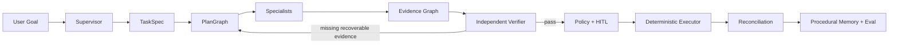

# 受控自治企业 Agent 架构

## 定位

平台在确定性 Workflow、Tool Gateway、Policy-as-Code、HITL 和持久化恢复之上增加受控自治层。目标不是让 LLM 自由执行，而是让模型能够提出计划、读取证据和解释决策，同时把授权、验证和写操作留在确定性边界内。



## TaskSpec

`TaskSpec` 是路由、规划、验证和评测共同使用的任务契约，包含：

- goal、scenario、requester、tenant
- 业务实体和来源
- Policy/Tool 约束
- 成功标准和所需 Evidence predicate
- 风险等级
- max steps、max replans、deadline、LLM call/cost、tool call 和 failure budget
- 当前缺失信息

Supervisor 完成场景路由后，`task_understanding` 节点会创建 TaskSpec，之后才进入场景子图。

## PlanGraph

计划步骤声明 Specialist、capability、tool、dependencies、preconditions、expected evidence、side effect、approval requirement 和 compensation。Validator 强制：

- step id 唯一
- dependency 存在且无环
- Specialist 和工具权限匹配
- side effect 在 Specialist 范围内
- write/external 步骤必须要求审批证据
- 不得超过 TaskSpec 预算
- 计划必须覆盖成功标准所需证据

生产默认使用确定性基线计划。开启 `AGENT_DYNAMIC_PLAN_ENABLED` 后，LLM 只能提交候选 PlanGraph；候选未通过上述门禁时自动回落基线。PlanGraph 不是展示数据：v3 场景配置通过 `plan_step`/`plan_steps` 把节点绑定到计划步骤，节点执行前必须通过依赖、预算和 Evidence 授权，执行后再写回步骤状态与 execution journal。

## 运行时预算

根图在 Supervisor 前初始化 `execution_budget`，所有节点共享同一任务级预算：

- active deadline，阻止过期任务继续执行
- LLM 最大调用次数和最大估算费用
- Tool Gateway 最大调用次数
- 最大失败次数
- 当前步骤、调用计数、失败计数和最后一次阻断原因

LLM Gateway 会按 tenant/thread/trace 查询持久化使用账本，而不只依赖进程内计数。工具或步骤超限时直接 fail closed，并保留执行日志用于 replay。

## Specialist 边界

| Specialist | 责任 | 副作用边界 |
| --- | --- | --- |
| Supervisor | 目标理解和计划协调 | none |
| Operations | 订单和流程状态 | read |
| Risk | 风险、历史、判例 | read / decision |
| Policy | RAG 和确定性规则 | read / decision |
| Finance | 财务准备和对账 | read / governed write |
| Access | 最小权限和 SoD | decision / governed write |
| Expense | 费用完整性 | decision / governed write |
| Verifier | 独立验证 | decision |
| Executor | 执行已授权计划 | governed write / external |

Specialist 不能因为是“Agent”就获得隐式权限。Tool Gateway、Policy 和审批凭证仍是最终执行边界。

## Evidence Graph

每条证据包含 predicate、subject、value、source、confidence、trace_id、observed_at 和 metadata。退款主链至少验证：

- `order.identity`
- `order.amount`
- `order.currency`
- `risk.score`
- `policy.decision`
- 高风险时的 `approval.decision`
- 执行后的 `finance.saga_status`
- 执行后的 `finance.reconciliation`

Evidence ID 根据内容稳定生成，并通过 `evaluated_by`、`governed_by`、`authorized_by`、`verified_by` 等关系形成证据图，可在 AuditLog 和 Dashboard replay 中解释“为什么允许执行”和“由什么验证”。

## Verifier 和有限重规划

财务写入前必须经过独立 Verifier。缺少可恢复的订单证据时，最多允许一次回到订单查询；金额非法、币种非法、策略证据缺失或高风险审批缺失会 fail closed。执行后还有第二道验证：退款必须核对已完成 Saga、贷项凭证、清账凭证与 Transactional Outbox；权限和报销必须核对业务单据、策略决策、审批证据和持久化结果。可选 LLM Critic 只能增加阻断理由，不能覆盖确定性失败。

## 程序性记忆

只有 `PlanGraph.status=completed` 且执行后验证通过的任务才会写入 `successful_plan`。保存的是经过治理的步骤、依赖、前置条件、预期证据、审批与补偿模板，不保存原始对话。后续同租户、同用户、同场景任务会在生成计划前检索 precedent；只有步骤集合匹配确定性基线且重新通过 PlanGraph validator 时才能复用，并且仍不能绕过证据、Policy、HITL 和 Tool Gateway。

## Eval

`bounded-autonomy-depth-v1` 当前包含 48 条门禁：

- TaskSpec 完整性
- PlanGraph 权限和依赖合法性
- Evidence 覆盖
- 正常执行通过
- 缺证据有限重规划
- 高风险缺审批阻断
- PlanGraph 运行时依赖与副作用授权
- 任务预算耗尽时 fail closed
- Evidence relation 完整性
- 执行后验证与财务对账

该门禁与 120 条生产型合成决策集、三个 v3 场景编译/E2E、trajectory、RAG、安全红队共同进入 P0 和 Enterprise Readiness。

## 开关

```text
AGENT_DYNAMIC_PLAN_ENABLED=false
AGENT_VERIFIER_LLM_ENABLED=false
AGENT_PROCEDURAL_MEMORY_ENABLED=true
```

默认配置保持确定性、低延迟。动态规划和 LLM Critic 应先通过 Simulation/Shadow 流量验证，再逐场景开启。
