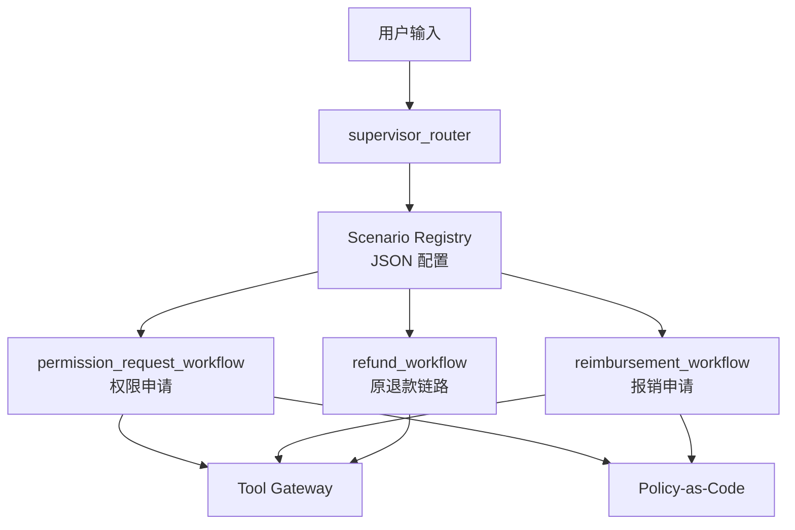

# Configurable Supervisor-based Multi-scenario Agent Platform

## 目标

本阶段把项目从单一“自动化退款 Agent”升级为“可配置 Supervisor 多场景企业 Agent 平台”的雏形。核心变化是：用户请求不再直接进入退款流程，而是先由 Supervisor 根据场景配置做路由，再分发到具体业务工作流。

当前已接入 3 个场景：

| 场景 | 工作流 | 关键能力 |
| --- | --- | --- |
| 退款支持 | `refund_workflow` | 意图识别、订单查询、风控、HITL、退款执行、通知 |
| 权限申请 | `permission_request_workflow` | 权限级别抽取、敏感系统识别、Policy-as-Code 审批判定、Tool Gateway 写入 |
| 报销申请 | `reimbursement_workflow` | 金额/类别抽取、费用策略判定、Tool Gateway 写入、审批路由 |

## 架构

## 配置化边界

场景配置位于 `backend/app/scenarios/*.json`。每个场景包含：

| 字段 | 作用 |
| --- | --- |
| `id` | 场景唯一标识 |
| `workflow` | 对应工作流名称 |
| `keywords` | Supervisor 规则路由关键词 |
| `tools` | 场景可调用工具 |
| `policies` | 场景关联策略 |
| `hitl` | 是否需要人工审批，以及审批角色 |

第一阶段采用“配置驱动路由 + 静态 LangGraph 节点注册”的方式，避免一次性做过重的 DSL。这样既能体现平台化设计，也能保持代码可调试、可测试。

## 面试表述

可以这样讲：

> 我把原来的退款 Agent 抽象成了 Supervisor-based 多场景平台。请求先进入 Supervisor，根据 JSON 场景配置选择业务工作流；每个场景声明自己的工具、策略、HITL 角色和关键词。这样新增权限申请、报销场景时，不需要复制一套 Agent 主流程，而是在统一的 Tool Gateway、Policy-as-Code、AuditLog 和 LangGraph 执行框架下扩展。

关键点：

- Supervisor 只做路由，不直接执行业务副作用，避免职责混乱。
- Tool Gateway 统一处理权限、幂等键、审计事件和 dry-run。
- Policy-as-Code 把审批规则从节点逻辑中拆出，便于测试和复用。
- 新场景先接入确定性解析和策略判定，后续可以升级为 LLM extraction 或 MCP tool integration。

## 后续可增强

- 把权限申请和报销也接入通用 ApprovalPanel，而不是只返回文本。
- 将 `workflow` 从静态映射升级为配置化 workflow factory。
- 给每个场景增加 golden eval cases。
- 做 Replay / Simulation Lab，对同一输入回放不同策略版本下的执行结果。
- 将 Tool Gateway 的工具协议升级为 MCP-compatible tool server。
